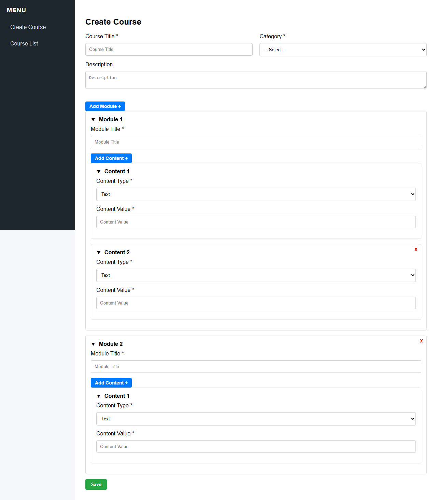

# Course Create for Softvenc

## 📸 Screenshot



## 🛠️ Installation and Setup

Follow these steps to get the project running on your local machine.

### 1. Clone the Repository

```bash
git clone https://github.com/Hannan84/course-create-softvenc.git
cd course-create-softvenc
```

### 2. Install PHP Dependencies via Composer

```bash
composer install
```

### 3. Copy the Environment File

```bash
cp .env.example .env
```

Then edit the `.env` file and set your database credentials:

```env
DB_DATABASE=your_database
DB_USERNAME=your_username
DB_PASSWORD=your_password
```

### 4. Generate Application Key

```bash
php artisan key:generate
```

### 5. Run Database Migrations

```bash
php artisan migrate
```

### 6. Start the Development Server

```bash
php artisan serve
```

Visit your app at: [http://localhost:8000]
